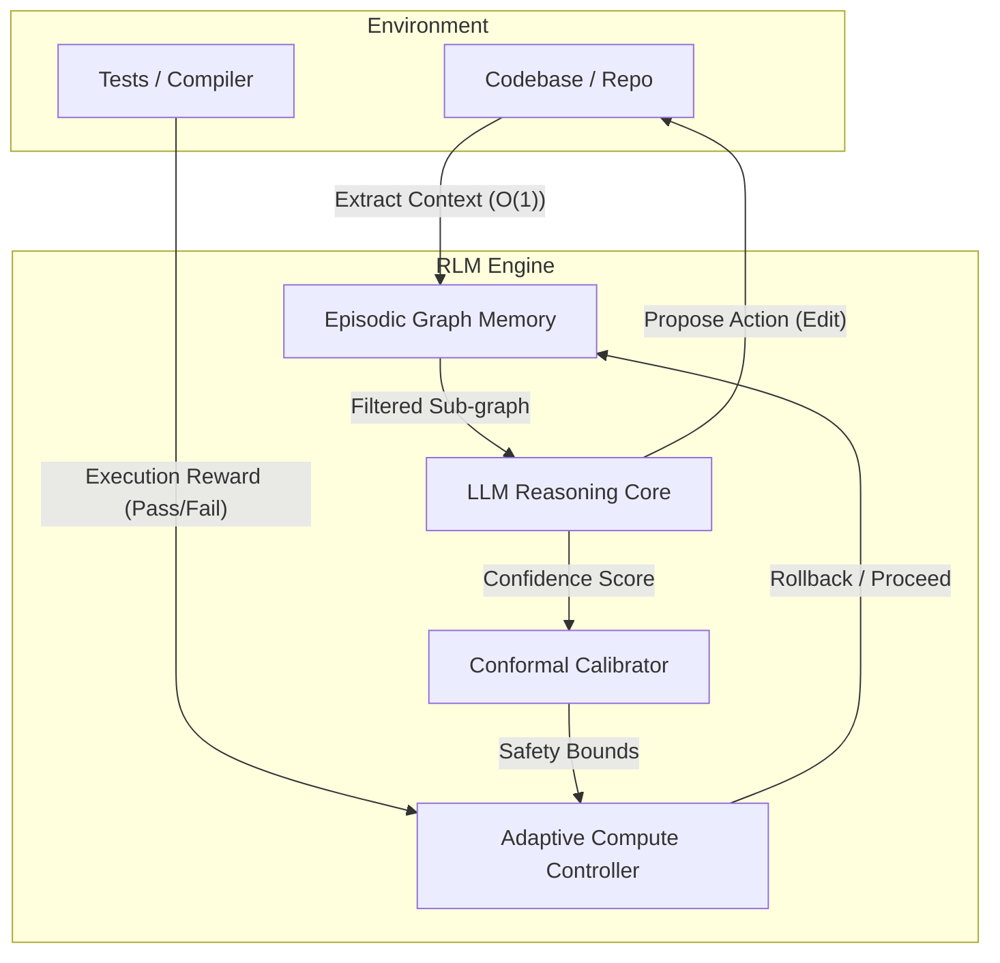

# Recursive Labs: RLM Framework

## The Problem

Every AI coding tool today compacts your conversation when it gets too long.
Claude Code does it at ~8k tokens. GPT compresses it. Cursor slides the window.

When it compacts, you lose:
- The exact error message that caused the bug
- The prior patch that didn't work (so the model tries it again)
- Which file was in which state before the last edit
- The specific test assertion that was failing

Then the model repeats itself. You re-explain the context. It fails again.

**This is not a model capability problem. It is a context management problem.**

---

## The Solution: Context OS + Recursive Recovery

**Recursive Labs** builds the RLM framework: a local-first context layer and
recursive execution loop that eliminates compaction entirely.

Instead of compressing history, RLM stores every state, action, outcome, and
test result in a local semantic graph — and retrieves only the relevant slice
(~2k–5k tokens) on each call, regardless of how long the session history is.

```
Naive approach:        50-turn session → 37,500 tokens sent per call → compact → lose info → repeat
RLM Context OS:        50-turn session → 3,000 tokens sent per call  → no compact → full recall
```

**~12× fewer input tokens. Zero information loss. No compaction latency.**

Every AI app on your machine — Claude Code, Cursor, terminal agents — can call
the same local MCP endpoint (`get_current_context`) and get the same live,
relevant context slice without managing any history themselves.

When a fix fails, RLM rolls back deterministically, records the failure in the
graph, and retries with the exact knowledge of what broke and why. This is the
recursive loop: the failure itself becomes the signal.

---

## The Bigger Bet

Software engineering is Horizon 0 because compilers and tests provide objective
reward signals. Every session where RLM avoids compaction also produces a
richer verified trajectory — the complete rollback→recovery path that existing
datasets discard. These trajectories are the training data for Horizon 1:
a smaller fine-tuned model that has *learned* to recover, not just been prompted to.

**Horizon 0 (ships now):** Context OS + recursive runtime. Any LLM, better results, lower cost.
**Horizon 1 (RLM-0):** Fine-tuned 8B model trained on recovery trajectories. Learns to backtrack.
**Horizon 2:** Native recursive architecture — rollback and verification as structural properties.

See `docs/` for the full research case, competitive analysis, and 10-experiment roadmap.

## The Architecture



### Core Components
1. **RLM Context OS:** A local-first context layer for Claude Code/Desktop, Cursor, terminal agents, and web agents. It packs active file state, terminal traces, intent, graph blast radius, and episodic memory into one shared context.
2. **RLM-Sync:** A local FastAPI/WebSocket broker that synchronizes workspace, terminal, and agent memory state across tools.
3. **System 2 Planner:** Builds a semantic context graph and plans against impacted dependents before edits are attempted.
4. **Episodic Memory:** Stores state/action/outcome/reward memories in repo-local `.rlm_memory.json` so agents avoid repeating failed approaches across runs.
5. **Execution-Grounded Verification (TDRL):** Treats task resolution as an RL environment (`TestDrivenEnv`) where compiler/tests act as the reward signal.
6. **Deterministic Rollback:** Snapshots edited files and restores them when verification fails, keeping the workspace clean.
7. **RLM-TestGen:** Generates failing pytest constraints from developer intent when no halting condition exists yet.

## Getting Started

### Installation
We use `uv` for lightning-fast dependency management.

```bash
# 1. Setup the virtual environment
uv venv
source .venv/bin/activate

# 2. Install dependencies
uv pip install fastapi uvicorn pydantic numpy gymnasium stable-baselines3 openai google-genai
```

### Running the Execution API
The RLM Engine runs as a FastAPI server, ready to receive execution tasks from any Agent or IDE.

```bash
# Start the API
PYTHONPATH=$(pwd)/.. uvicorn RLM.api.main:app --port 8000 --reload
```

### Running RLM Context OS via MCP
The first integration surface is a local stdio MCP server. It is read-only by default; the only write tool is the explicit `write_agent_memory` call.

```bash
PYTHONPATH=$(pwd)/.. python -m RLM.api.mcp_server
```

MCP tools:
- `get_current_context`
- `get_active_file`
- `get_terminal_trace`
- `get_relevant_memories`
- `get_blast_radius`
- `write_agent_memory`

`get_current_context` packs active file and selection, latest terminal/test trace, developer intent, graph blast radius, failure warnings, and recent successful/failed actions. This is the wedge: every AI app on the laptop can ask one local layer for the same live project context.

## The Demo (Autonomous Coding Agent)
You can trigger the agent to autonomously fix a broken codebase. The engine will retrieve context, propose a patch, run the unit tests, and rollback/retry if it hallucinates, all without human intervention.

```bash
curl -X POST "http://127.0.0.1:8000/v1/rlm/execute" \
     -H "Content-Type: application/json" \
     -d '{
           "repo_path": "./demo_target", 
           "task_description": "Fix the sorting and division bugs", 
           "test_command": "pytest ./demo_target/test_math.py", 
           "max_steps": 10
         }'
```

## Reproducing the YC Proof Table
`ablation_results.csv` is generated from trace JSONs, not edited by hand. The default benchmark contract is deterministic so it can run without API keys while preserving the trace schema expected from model-backed runs. Treat contract numbers as CI validation only, not external proof.

```bash
PYTHONPATH=$(pwd)/.. python -m RLM.experiments.benchmark_suite \
  --tasks 100 \
  --out experiments/results/yc_proof

PYTHONPATH=$(pwd)/.. python -m RLM.experiments.summarize_results \
  --in experiments/results/yc_proof \
  --out ablation_results.csv
```

For real model-backed evidence, use task fixtures where each task directory contains a `task.json` with `task_id`, `description`, `test_command`, and `success_criteria`, plus the files to copy into an isolated run directory:

```bash
PYTHONPATH=$(pwd)/.. python -m RLM.experiments.benchmark_suite \
  --mode real \
  --tasks-dir experiments/tasks/seeded_regressions \
  --out experiments/results/yc_real

PYTHONPATH=$(pwd)/.. python -m RLM.experiments.summarize_results \
  --in experiments/results/yc_real \
  --out ablation_results.csv
```

Every trace records method, task id, model/source, success, steps, context-token estimate, failure loops, runtime, actions, rollback events, memory events, test outputs, and final diff. No external claim like “86% success” should be used unless regenerated from `source=real_model` traces.

## YC Demo Path
1. Show the fragmented-context problem: the model sees a file but not the latest terminal failure or prior failed attempts.
2. Query `get_current_context` through MCP and show the same live context available to every local AI app.
3. Run RLM-1 on a seeded software task: planner sees graph context, the first failed edit is rolled back, episodic memory writes the failure, and a later attempt passes tests.
4. Open the saved trace JSON and show retrieved memory IDs, rollback files, test output before/after, final diff, and token estimate.
5. Regenerate `ablation_results.csv` from traces only.

## Native RLM Roadmap
1. **Horizon 0:** Use software engineering as the calibration lab because tests provide binary rewards.
2. **Horizon 1:** Fine-tune smaller models on verified RLM trajectories from planning, edits, failures, rollbacks, and successful fixes.
3. **Horizon 2:** Train native recursive models that internalize memory, verification, and backtracking behavior instead of relying only on an external wrapper.

## Research & Documentation
See the upcoming Technical Report for baseline comparisons showing how RLM reduces unnecessary reasoning steps and improves reliability in controlled agentic tasks.
